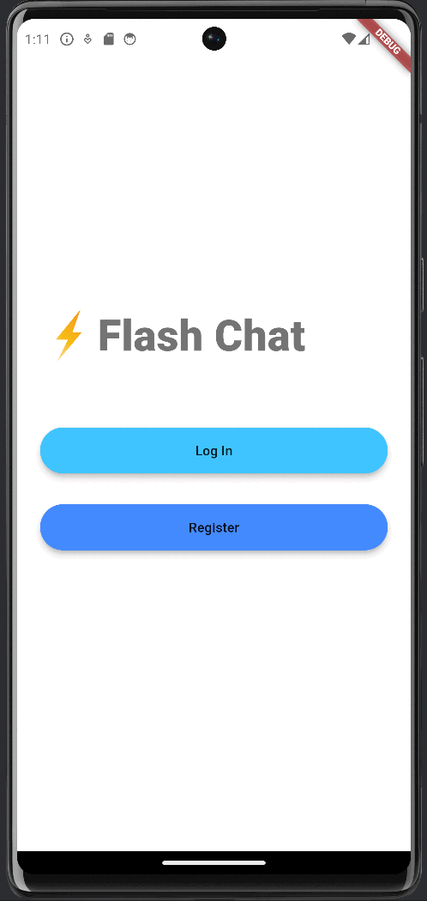

# Flash Chat App

Flash Chat is a simple chat application built as part of the Udemy course "The Complete Flutter Development Bootcamp with Dart." This app demonstrates the use of various Flutter features including animations, Firebase integration, and principles of Object-Oriented Programming (OOP).

## Description

Flash Chat provides a seamless chat experience with features such as user authentication and real-time messaging. The app consists of a welcome screen, login and registration screens, and a chat screen where users can communicate in real-time.

## Features

- **User Authentication**: Secure login and registration using Firebase Authentication.
- **Real-Time Messaging**: Send and receive messages instantly using Cloud Firestore.
- **OOP Principles**: Implementation of Object-Oriented Programming concepts.
- **Animations**: Smooth transitions and animations for an enhanced user experience.
- **Streams and StreamBuilder**: Efficiently handle real-time data using Streams and StreamBuilder.

## Demo

